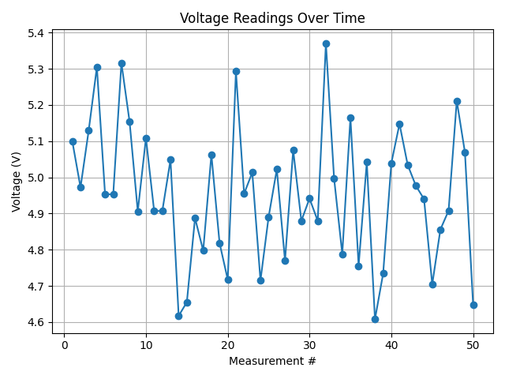

# Voltage Logger Project

This project simulates and records voltage measurements using Python, exports the data to Excel, and generates a plot of the measurements. It demonstrates practical automation for laboratory and data analysis tasks.

## Features

- Simulates 50 voltage readings with random noise
- Saves measurements to an Excel file (`voltage_readings.xlsx`)
- Plots voltage readings and saves as an image (`voltage_plot.png`)

## Example Output


*Figure: Voltage measurements simulated and plotted with Python.*

## How to Run

1. Install Python (version 3.x recommended)
2. Install required packages:
    ```
    pip install pandas matplotlib numpy openpyxl
    ```
3. Run the script:
    ```
    python voltage_logger.py
    ```
4. View the generated Excel file and voltage plot image.

## Files

- `voltage_logger.py`: Main Python script
- `voltage_readings.xlsx`: Example output (Excel)
- `voltage_plot.png`: Example output (plot image)

## Contact

For questions or feedback, contact [sulemanextramail@gmail.com].
